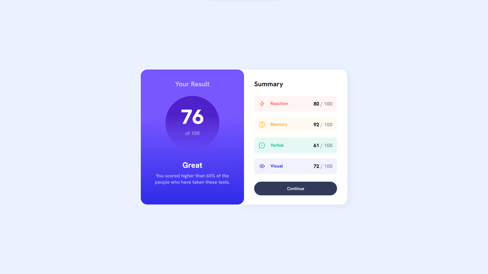
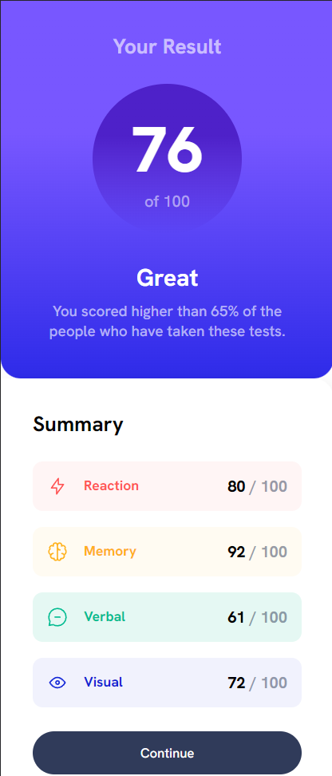

# Frontend Mentor - Results summary component solution

This is a solution to the [Results summary component challenge on Frontend Mentor](https://www.frontendmentor.io/challenges/results-summary-component-CE_K6s0maV). Frontend Mentor challenges help you improve your coding skills by building realistic projects. 

## Table of contents

- [Frontend Mentor - Results summary component solution](#frontend-mentor---results-summary-component-solution)
  - [Table of contents](#table-of-contents)
  - [Overview](#overview)
    - [The challenge](#the-challenge)
    - [Screenshot](#screenshot)
    - [Links](#links)
  - [My process](#my-process)
    - [What I learned](#what-i-learned)
    - [Useful resources](#useful-resources)
  - [Author](#author)

## Overview

### The challenge

Users should be able to:

- View the optimal layout for the interface depending on their device's screen size
- See hover and focus states for all interactive elements on the page

### Screenshot





### Links

- Solution URL: [GitHub](https://github.com/justinnvera/Results-Summary-Component)
- Live Site URL: [Vercel](https://results-summary-component-smoky-two.vercel.app)

## My process

### What I learned

I learned how to create shapes using `<div>` elements. In this case, I had to create a circle for the overall score. 

See below: 

```html
<div class="overall-score">
  <div class="overall-score-background">

  </div>
  <p id="result-1">76</p>
  <p id="result-2">of 100</p>
</div>
```
```css
.overall-score {
    display: flex;
    flex-direction: column;
    position: relative;
    justify-content: flex-start;
    align-items: center;
    height: 170px;
    margin-bottom: 3.5rem;
}
.overall-score-background {
    position: absolute;
    width: 170px;
    height: 170px;
    border-radius: 50%;
    background: linear-gradient(180deg, rgba(78,33,201,1) 35%, rgba(36,33,202,0) 100%);
    top: 1.5rem;
}
```
### Useful resources

- [CSS Gradient Generator](https://cssgradient.io) - This helped me generate my gradients for the `.left` `<div>` card. All I had to do was set it to 180 degrees and select linear gradient. From there, it's as easy as inputting the RGBA values.
- [CSS Box Shadow Generator](https://html-css-js.com/css/generator/box-shadow/) - I always use this for creating `box-shadow` since it can get a tedious to do manually.
- 
## Author

- Website - [Add your name here](https://www.justinvera.com)
- Frontend Mentor - [@yourusername](https://www.frontendmentor.io/profile/justinnvera)
